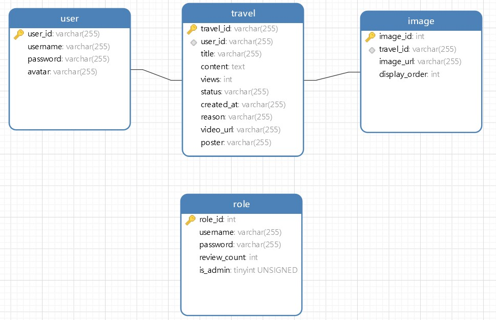

# 旅游日记平台及审核管理系统后端

## 简介

后端实现基于Nodejs，相关技术栈有Nodejs+express+mysql

## 快速开始

`npm install` 安装所有依赖

`npm start` 启动后端

## API在线查看地址
[API文档](https://www.hyperyz.com:3000/api-docs)

## 数据库

| status |   说明   |
| :----: | :------: |
|  '0'   |  待审核  |
|  '1'   |  未通过  |
|  '2'   | 审核通过 |
|  '4'   | 逻辑删除 |

